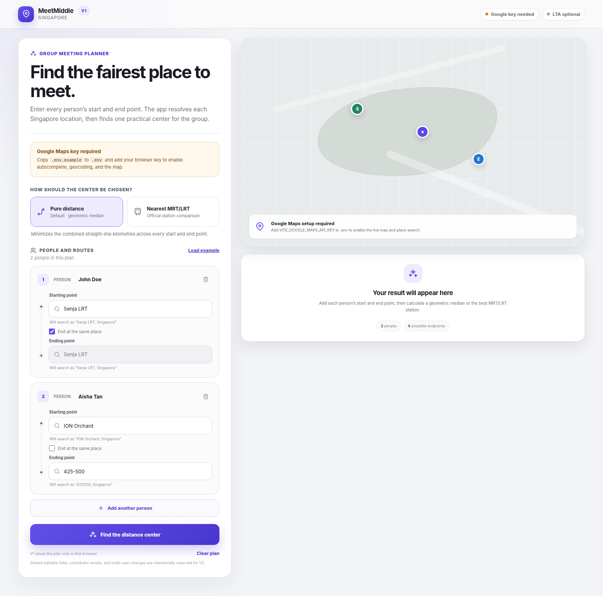

# Meet Where Sia

A Singapore-focused group meeting-point planner. Each participant supplies a starting point and, optionally, a different ending point. The app resolves those locations and recommends either:

1. **MRT/LRT travel time (default)** — the connected rail station that minimizes the longest estimated journey, with the group average used as the tie-breaker.
2. **Pure distance** — a geometric median that approximately minimizes the combined straight-line distance to every start and end point.



## Current functionality

- React 19, TypeScript, Vite, Vercel Functions, and a small Express server for local/Docker use.
- MRT/LRT travel-time mode is selected by default.
- Add or remove any number of participants in one organizer-controlled plan.
- Each participant has a name, start, end, and **End at the same place** option, selected by default.
- Every connected MRT/LRT station is evaluated; no straight-line radius pre-filter is applied to rail journeys.
- Local Singapore rail graph covering the current MRT/LRT passenger network, including Hume and CCL6.
- Estimated access walking, train segments, waits, interchange walking, and transfer waits.
- Exact MRT/LRT station names and Singapore latitude/longitude coordinates work without Google.
- Google place suggestions are restricted to Singapore and every typed query is searched with `, Singapore` appended once.
- Six-digit postal-code variants such as `425-500` and `425 500` are normalized to `425500` before searching.
- A typed location can still be geocoded when the user does not pick an autocomplete suggestion.
- An always-available interactive map with markers for starts, ends, the selected meeting point, and close MRT/LRT alternatives.
- A Leaflet map using the official Google Maps Map Tiles API when configured, including Google Maps and viewport data attribution in the bottom-right control.
- Automatic OpenStreetMap fallback when no Google key is configured or Google tiles are unavailable.
- Rail results show average, longest, and total estimated journey time plus alternatives and journey breakdowns.
- Official LTA station-exit coordinates are aggregated into one point per MRT/LRT station.
- Optional LTA DataMall train-service status check through the server API.
- Browser-only plan persistence with `localStorage`.
- Responsive desktop and mobile layouts.
- Loading, empty, validation, API-setup, and upstream-error states.
- No secrets or real API keys are included in this repository.

## How the recommendation works

### Pure distance

The arithmetic mean of latitude and longitude is a visual centroid, but it does not generally minimize the sum of distances. This app instead runs **Weiszfeld's algorithm** on a Singapore-scale local tangent plane to approximate the geometric median. Final metrics use Haversine distance.

Every participant contributes two endpoint observations. When **End at the same place** is selected, the start coordinate is also used as that participant's end coordinate. This keeps every participant weighted consistently with two observations.

### MRT/LRT travel time (default)

The server downloads the official LTA station-exit GeoJSON from data.gov.sg, groups exits by station name, and averages each station's exit coordinates. Because that dataset can lag newly opened stations, currently operational stations absent from it are supplemented with official station-centre coordinates from Singapore OneMap. A fallback is automatically ignored once LTA's station-exit feed supplies that station. The client evaluates every connected station and runs shortest-path searches over a local MRT/LRT graph.

Each endpoint is attached to its nearest connected station. A journey estimate includes straight-line access distance adjusted for a walking path, average initial wait, distance-based train segments, and an interchange cost containing both walking and another average wait. Candidate stations are sorted by:

1. Lowest longest-endpoint journey, so one person is not given a much worse trip merely to reduce the group total.
2. Lowest average journey across all endpoints as the tie-breaker.
3. Lowest distance from the geometric center as the final tie-breaker.

Transfer walking and waiting are included once in each affected journey. They are not separately added to the station ranking; their effect is already present in the journey duration.

The topology follows the current passenger network published by LTA as of July 2026. Station names and coordinates remain runtime official data; the graph timing constants are explicit estimates in `src/lib/railGraph.ts`.

### Important limitation

LTA DataMall does not publish a public station-to-station rail timing API. The local graph is therefore an efficient planning estimate, not an official timetable or live journey planner. It does not model exact platform paths, service headways by time of day, disruptions, crowding, fares, accessibility, or street-level walking routes. Singapore's official OneMap routing API can provide time-dependent public-transport itineraries, but requires a OneMap token and online requests; it is a possible validation layer for the top few local-graph candidates.

## Map providers and optional Google setup

The interactive map always uses Leaflet. With a configured Google key, its base layer comes from the documented Google Maps Map Tiles API. The bottom-right attribution control retains Leaflet attribution and displays Google Maps plus the viewport-specific copyright returned by Google. Exact MRT/LRT station names and Singapore coordinates such as `1.3521, 103.8198` also resolve without Google.

Google is also used for arbitrary place/address and postal-code resolution, autocomplete, and reverse-geocoded result labels. The implementation does not use undocumented tile URLs.

OpenStreetMap's public raster tiles are appropriate for modest interactive use and require the visible attribution included on the map. For substantial production traffic, configure a commercial or self-hosted OSM-derived tile provider instead of relying on the community-funded public tile servers.

### 1. Create and restrict a browser key

Enable these services in the same Google Cloud project:

- Map Tiles API
- Maps JavaScript API
- Places API (New)
- Geocoding API

Restrict the key by:

- **Application restriction:** Websites / HTTP referrers, including your localhost and production origins.
- **API restriction:** Only the three services listed above.

A browser Maps key is visible to website visitors by design. Security comes from referrer and API restrictions, quotas, and monitoring—not from trying to hide the key in React source.

### 2. Configure the project

```bash
cp .env.example .env
```

Then edit `.env`:

```dotenv
VITE_GOOGLE_MAPS_API_KEY=
LTA_ACCOUNT_KEY=
PORT=8787
```

The Google key is optional. Without it, the app automatically uses OpenStreetMap and still supports official MRT/LRT station names and Singapore coordinates.

## LTA API setup and use

The LTA DataMall key is optional. Put it only in the server-side variable:

```dotenv
LTA_ACCOUNT_KEY=your_lta_datamall_account_key
```

Do **not** rename it with a `VITE_` prefix; Vite-prefixed variables are compiled into the browser bundle.

The app currently uses the AccountKey for:

- `TrainServiceAlerts`, so MRT mode can show whether LTA reports normal/minor-delay service or a major disruption.

The AccountKey is not needed for station geometry. Station locations come from LTA's public static/open-data GeoJSON, proxied and cached by the server API.

Other potentially useful LTA DataMall additions include station crowd density, crowd forecasts, facilities maintenance, passenger-volume data, and bus information. They do not directly provide a general door-to-door route planner, so they are not used in the current recommendation.

## Run locally

### Requirements

- Node.js 22.12 or later
- npm

### Development mode

```bash
npm install
npm run dev
```

Open the Vite URL shown in the terminal, normally `http://localhost:5173`.

- React/Vite runs on port `5173`.
- Express runs on port `8787`.
- Vite proxies `/api/*` to Express.

### Production build

```bash
npm run build
npm start
```

Open `http://localhost:8787`.

### Type-check only

```bash
npm run check
```

## Deploy to Vercel

Import this repository into Vercel and leave the detected framework as **Vite**. The checked-in `vercel.json` selects Singapore (`sin1`) for the API functions, while Vercel builds the frontend into `dist` using `npm run build`.

The three API URLs have explicit files under `api/`, so Vercel deploys each URL as its own function:

- `api/health.js` → `/api/health`
- `api/mrt-stations.js` → `/api/mrt-stations`
- `api/lta/train-alerts.js` → `/api/lta/train-alerts`

No environment variables are required for a working station-name/coordinate-only deployment. Add these in **Project Settings → Environment Variables** only for the corresponding optional features:

- `VITE_GOOGLE_MAPS_API_KEY` — Google Maps tiles, arbitrary addresses, postal codes, place search, and reverse geocoding. This is compiled into the frontend at build time, so redeploy after changing it. OpenStreetMap rendering needs no key.
- `LTA_ACCOUNT_KEY` — live LTA train-service alerts. This remains server-side.

`PORT` is only for local/Docker execution; do not set it on Vercel.

## Docker

If Google features are wanted, the browser key must be present at image build time because Vite compiles it into the static bundle. It can be omitted for OpenStreetMap and station-name/coordinate use. The optional LTA key remains a runtime server variable.

```bash
docker build \
  --build-arg VITE_GOOGLE_MAPS_API_KEY="your_restricted_browser_key" \
  -t meet-where-sia .

docker run --rm -p 8787:8787 \
  -e LTA_ACCOUNT_KEY="your_lta_datamall_account_key" \
  meet-where-sia
```

## Example flow

Use the built-in **Load example** action to populate:

- John Doe: `Senja LRT` → same place.
- Aisha Tan: `Orchard MRT` → `Paya Lebar MRT`.

The example works without Google. Select official station suggestions or press calculate and let exact station names resolve against the downloaded LTA station list.

## API routes

| Route | Purpose |
|---|---|
| `GET /api/health` | Reports server status and whether the two keys are configured. |
| `GET /api/mrt-stations` | Downloads, aggregates, and caches official LTA MRT/LRT station-exit data. |
| `GET /api/lta/train-alerts` | Calls LTA DataMall with the server-side `AccountKey`; returns a safe normalized status. |

The station list is cached in memory for 12 hours. LTA service alerts are cached for 60 seconds.

## Project structure

```text
meet-where/
├── api/                       # URL-matched Vercel function handlers
│   ├── lta/train-alerts.js
│   ├── health.js
│   └── mrt-stations.js
├── server/
│   ├── index.mjs              # Express routes for local/Docker use
│   ├── local.js               # Local listener and built frontend serving
│   └── services.mjs           # Shared LTA proxy, normalization, and caches
├── src/
│   ├── components/            # Inputs, participant cards, map, result panel
│   ├── lib/
│   │   ├── centroid.ts        # Haversine and geometric median
│   │   ├── railGraph.ts       # Rail topology, timing model, shortest paths
│   │   ├── googleMaps.ts      # Maps loader, geocoding, reverse geocoding
│   │   ├── location.ts        # Singapore scoping and postal normalization
│   │   └── api.ts             # Browser calls to /api
│   ├── App.tsx
│   ├── styles.css
│   └── types.ts
├── .env.example
├── Dockerfile
├── package.json
├── vercel.json
└── vite.config.ts
```

## Future roadmap

The UI already separates participant records from the calculation logic, so a shared-plan backend can be added without redesigning the recommendation engine. Potential future work includes:

- Shareable plan IDs and editable links.
- Email or one-time-link contributor identity.
- Server-side persistence and optimistic concurrency/versioning.
- Organizer permissions, participant-level edit permissions, and an audit log.
- Live synchronization through WebSockets or server-sent events.
- Expiring links, rate limits, abuse protection, and deletion controls.
- Optional travel-time, accessibility, venue-category, and operating-hours filters.

## Official data and API references

- [Google Maps JavaScript Place Autocomplete Data API](https://developers.google.com/maps/documentation/javascript/place-autocomplete-data)
- [Google Maps JavaScript Geocoding service](https://developers.google.com/maps/documentation/javascript/geocoding)
- [Google Maps Platform API security guidance](https://developers.google.com/maps/api-security-best-practices)
- [Google Maps Map Tiles API](https://developers.google.com/maps/documentation/tile)
- [Google Maps 2D tiles](https://developers.google.com/maps/documentation/tile/2d-tiles-overview)
- [Google Maps tile attribution policy](https://developers.google.com/maps/documentation/tile/policies)
- [Leaflet documentation](https://leafletjs.com/reference.html)
- [OpenStreetMap tile usage policy](https://operations.osmfoundation.org/policies/tiles/)
- [LTA DataMall](https://datamall.lta.gov.sg/)
- [LTA static datasets](https://datamall.lta.gov.sg/content/datamall/en/static-data.html)
- [LTA MRT Station Exit GeoJSON on data.gov.sg](https://data.gov.sg/datasets/d_b39d3a0871985372d7e1637193335da5/view)
- [LTA current rail network](https://www.lta.gov.sg/content/ltagov/en/getting_around/public_transport/rail_network.html)
- [OneMap Search API](https://www.onemap.gov.sg/apidocs/search)
- [OneMap public-transport routing API](https://www.onemap.gov.sg/apidocs/routing)
- [LTA Circle Line 6](https://www.lta.gov.sg/content/ltagov/en/upcoming_projects/rail_expansion/circle_line_6.html)
- [LTA Hume station opening](https://www.lta.gov.sg/content/ltagov/en/newsroom/2025/1/news-releases/hume_station_to_open.html)
- [LTA Punggol Coast station opening](https://www.lta.gov.sg/content/ltagov/en/newsroom/2024/12/news-releases/punggol_coast_station_welcomes_commuters.html)
