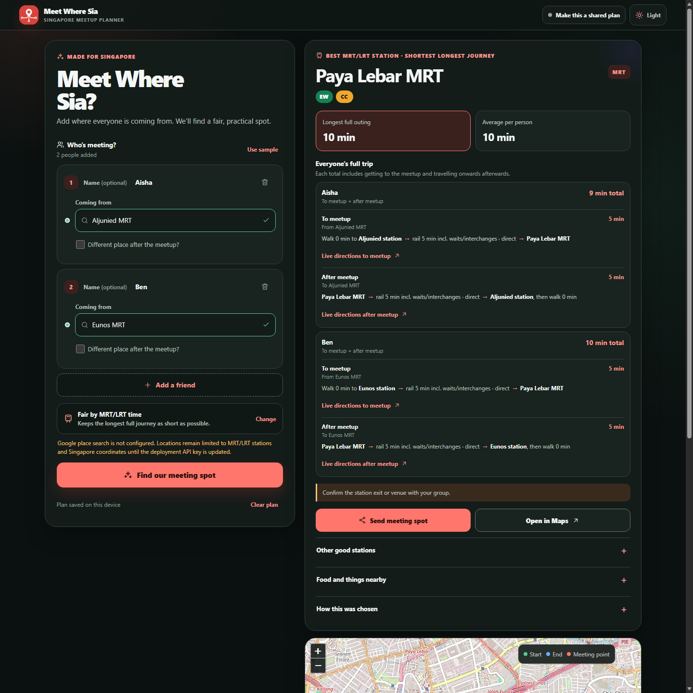

# Meet Where Sia

Meet Where Sia is a Singapore-focused meetup planner that finds a fair, practical meeting point for a group. Add where everyone starts—and, if needed, where they need to end—then compare recommendations by estimated MRT/LRT travel time or straight-line distance.

**Live app:** [meet-where-sia.vercel.app](https://meet-where-sia.vercel.app)



## Why use it?

- **Plan for the whole group.** Add any number of people, with separate start and end locations when a return journey is not enough.
- **Optimise for fairness.** Rail recommendations minimise the longest estimated journey first, then use the group average as a tie-breaker.
- **Share one live plan.** Create a link, let friends add or update their own route, and keep organiser controls separate.
- **Find somewhere nearby.** Explore hawker centres, attractions, coffee, activities, and outdoor options around the result.
- **Use it without paid APIs.** Exact MRT/LRT station names, Singapore coordinates, official station data, and the OpenStreetMap fallback work without a Google key.

## Features

- Estimated travel across the connected Singapore MRT/LRT passenger network
- Pure-distance mode using a geometric median rather than a simple midpoint
- Interactive map with participant endpoints, the selected meeting point, and close alternatives
- Google place search, geocoding, and map tiles when an optional browser key is configured
- Official LTA station-exit data, supplemented for operational stations missing from that feed
- Optional LTA DataMall train-service alerts
- Local plans saved in the browser
- Shared plans backed by Redis, with public read-only links and role-based editing
- Responsive light and dark interfaces
- Vercel, local Node.js, and Docker deployment options

## How recommendations work

### MRT/LRT travel time

Every endpoint is attached to its nearest connected station. The planner runs shortest-path searches over a local rail graph and estimates:

- access walking time;
- initial wait time;
- time on each rail segment; and
- interchange walking and transfer waits.

Candidate stations are ranked by the lowest worst-case journey, then the lowest group average, then proximity to the group's geometric centre. This makes the result favour fairness without ignoring total travel time.

The graph is represented in [`src/lib/railGraph.ts`](src/lib/railGraph.ts). Station names and coordinates come from official runtime data where available, while journey timings are explicit planning estimates—not official timetables. They do not model exact walking routes, fares, accessibility, crowding, or time-of-day service patterns.

### Pure distance

Pure-distance mode uses [Weiszfeld's algorithm](https://en.wikipedia.org/wiki/Geometric_median) on a Singapore-scale local tangent plane to approximate the geometric median. Final distances use the Haversine formula.

Each participant contributes a start and end observation. When **End at the same place** is selected, the start is counted again as the end so every participant keeps equal weight.

## Shared plans and privacy

Local plans stay in the browser's local storage. Shared plans require a Redis-compatible Vercel/Upstash store and use the following access model:

- Anyone with the plan link can view participant names and locations.
- The owner can manage the plan, participants, joining, and contributor access.
- Contributors sign in with a username and password and can edit only their assigned participant.
- Passwords are stored as salted scrypt hashes; sessions use secure HTTP-only cookies in production.

Treat shared links as group-visible links. Prefer stations or approximate locations over home addresses. See the app's [`privacy.html`](public/privacy.html) and [`terms.html`](public/terms.html) for the user-facing policies.

## Quick start

### Requirements

- Node.js 22.x
- npm

### Run locally

```bash
git clone https://github.com/yewey2/meet-where-sia.git
cd meet-where-sia
npm install
cp .env.example .env
npm run dev
```

Open the Vite URL shown in the terminal, normally <http://localhost:5173>. The frontend runs on port `5173`; the local API runs on port `8787` and is available through Vite's `/api` proxy.

The optional integrations can be left blank. Without them, the app still supports station-name and coordinate input, the rail planner, official nearby datasets, and OpenStreetMap.

```dotenv
VITE_GOOGLE_MAPS_API_KEY=
LTA_ACCOUNT_KEY=
UPSTASH_REDIS_REST_URL=
UPSTASH_REDIS_REST_TOKEN=
PORT=8787
```

Useful commands:

| Command | Purpose |
| --- | --- |
| `npm run dev` | Start the Vite frontend and local API in watch mode |
| `npm run build` | Type-check and build the production frontend |
| `npm start` | Serve the built app and API on port `8787` |
| `npm run check` | Run the TypeScript checks only |
| `npm test` | Run the Node.js test suite |

Use **Load example** in the app for a quick smoke test. The Aljunied and Eunos example should recommend Paya Lebar in rail mode.

## Optional services

### Google Maps Platform

Set `VITE_GOOGLE_MAPS_API_KEY` to enable arbitrary Singapore addresses, postal codes, autocomplete, reverse geocoding, and Google map tiles. Enable and restrict the key to:

- Map Tiles API
- Maps JavaScript API
- Places API (New)
- Geocoding API

Use website/HTTP-referrer restrictions for localhost and production origins, add API restrictions, set quotas, and monitor usage. A `VITE_` variable is compiled into the browser bundle and is visible to visitors by design.

### LTA DataMall

Set the server-only `LTA_ACCOUNT_KEY` to enable train-service status. Never add a `VITE_` prefix to this key.

### Shared-plan storage

Set a writable Upstash REST URL and token to enable shared plans. The app accepts these credential pairs:

- `UPSTASH_REDIS_REST_URL` and `UPSTASH_REDIS_REST_TOKEN`
- `UPSTASH_REDIS_KV_REST_API_URL` and `UPSTASH_REDIS_KV_REST_API_TOKEN`
- `KV_REST_API_URL` and `KV_REST_API_TOKEN`

See [Deployment](docs/DEPLOYMENT.md) for complete Vercel and Docker instructions.

## API routes

| Route | Purpose |
| --- | --- |
| `GET /api/health` | Report API status and optional service configuration |
| `GET /api/mrt-stations` | Fetch, aggregate, supplement, and cache official MRT/LRT station data |
| `GET /api/nearby?lat=…&lng=…&radiusKm=…` | Return nearby official hawker centres and attractions |
| `GET /api/lta/train-alerts` | Return a normalised LTA train-service status |
| `GET/POST /api/plans` | Read, create, authenticate, and update shared plans |

Station and nearby-place datasets are cached in memory for 12 hours. Train alerts are cached for 60 seconds. Nearby searches are restricted to Singapore and a radius from 0.5 km to 3 km.

## Project structure

```text
meet-where-sia/
├── api/                 # Vercel Function entry points
├── docs/                # Public project and deployment documentation
├── public/              # Static images and user-facing policies
├── server/              # Shared services and local/Docker server
├── src/
│   ├── components/      # Planner, map, result, and shared-plan UI
│   └── lib/             # Location, map, rail, geometry, and plan logic
├── test/                # Node.js tests
├── Dockerfile
├── package.json
├── vercel.json
└── vite.config.ts
```

## Data and acknowledgements

Meet Where Sia uses or links to data and services from:

- [LTA DataMall](https://datamall.lta.gov.sg/)
- [data.gov.sg](https://data.gov.sg/), including LTA station exits, NEA hawker centres, and STB attractions
- [Singapore OneMap](https://www.onemap.gov.sg/)
- [OpenStreetMap](https://www.openstreetmap.org/) contributors
- [Google Maps Platform](https://developers.google.com/maps), when configured

Review each provider's terms, attribution requirements, and usage limits before operating a public deployment.

## Contributing and security

Bug reports and focused pull requests are welcome. Read [CONTRIBUTING.md](CONTRIBUTING.md) before opening a change. Please report security issues privately as described in [SECURITY.md](SECURITY.md), not through a public issue.

## Support

If this project is useful to you, you can support its upkeep through [GitHub Sponsors](https://github.com/sponsors/yewey2) or [Ko-fi](https://ko-fi.com/sycprojects).

## License

This repository does not currently include an open-source licence. Source code is publicly visible, but no reuse rights are granted until a licence is added.
